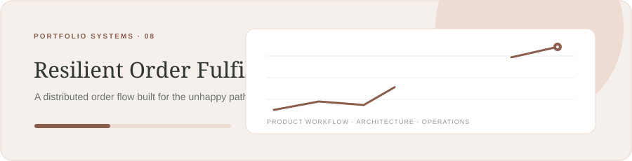

# Relay — Resilient Order Fulfillment

**A distributed order flow built for the unhappy path.**

Java · Spring Boot · Kafka · PostgreSQL

## Product scope

Coordinate inventory, payment, and shipping while preserving a truthful order state through partial failure.

## Architecture notes

Transactional outbox; idempotent consumers; bounded retry and dead-letter handling; saga compensation; order-history audit.

### Data model sketch

    orders(id, status, idempotency_key) · outbox_events(id, aggregate_id, payload, published_at) · saga_steps(order_id, step, state, attempt)

## Stack

Java · Spring Boot · Kafka · PostgreSQL

## Build sequence

1. Order API and idempotency
2. Outbox and asynchronous events
3. Failure injection and compensation
4. Recovery runbooks and observability

## Current status

Public repository with an animated README. Product code is being built incrementally, one project at a time. This page records the planned product boundary and engineering milestones.

## License

MIT.
